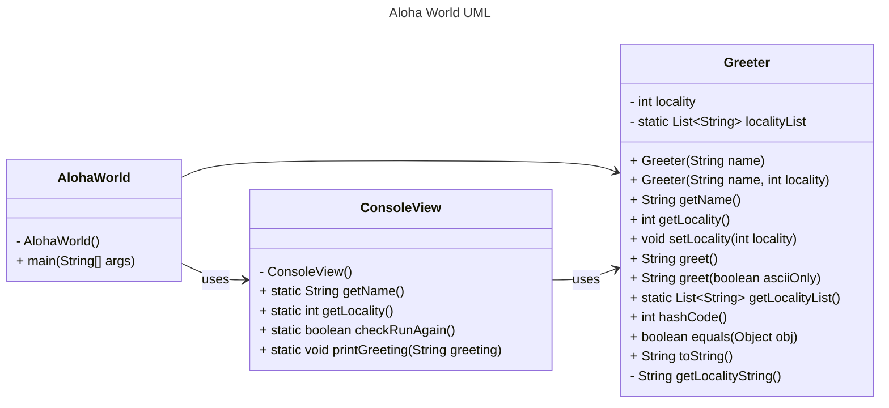
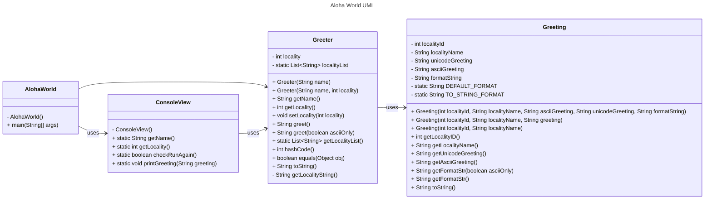

# Homework Aloha World Report

The following report contains questions you need to answer as part of your submission for the homework assignment. 


## Design Doc
Please link your UML design file here. See resources in the assignment on how to
link an image in markdown. You may also use [mermaid] class diagrams if you prefer, if so, include the mermaid code here.  You DO NOT have to include Greeting.java as part of the diagram, just the AlohaWorld application that includes: [AlohaWorld.java], [Greeter.java], and [ConsoleView.java].

### Aloha World UML Diagram

Below is the UML diagram for the Aloha World application:


after finishing the Greeting part, the whole version:



### Program Flow
Write a short paragraph detailing the flow of the program in your own words. This is to help you understand / trace the code (and give you practice of something called a code walk that will be required in this course).

The Aloha World application starts in the main() method of the AlohaWorld class. It collects the user’s name and location using ConsoleView, which interacts with the user through static methods. The Greeter class is instantiated with the user’s details, generating personalized greetings displayed via ConsoleView. The program allows the user to update their location in a loop until they choose to exit, effectively separating input handling, greeting generation, and program control.
## Assignment Questions

1. List three additional java syntax items you didn't know when reading the code.  (make sure to use * for the list items, see example below, the backtick marks are used to write code inline with markdown)
   
   * (example) `final class`
   * `this()`method in writing Greeting.java class(line 61, line 73)
   * `string.format()`
   * `instanceof`


2. For each syntax additional item listed above, explain what it does in your own words and then link a resource where you figured out what it does in the references section. 

    * (example) The `final` keyword when used on a class prevents the class from being subclassed. This means that the class cannot be extended by another class. This is useful when you want to prevent a class from being modified or extended[^1] . It is often the standard to do this when a class only contains static methods such as driver or utility classes. Math in Java is an example of a final class[^2] .
    * The `this()` method is used in a constructor to call another constructor in the same class. It allows for constructor chaining, reducing redundancy and simplifying the initialization process by reusing existing constructors[^3].
    * The `String.format()` method is used to create formatted strings in Java. It replaces placeholders in a string (like %s or %d) with provided arguments, making it useful for dynamic text generation[^4].
    * The `instanceof` operator checks whether an object is an instance of a specific class or a subclass. It is often used to ensure type safety before performing operations on an object[^5].

3. What does `main` do in Java? 

    Go ahead and answer the question as a short paragraph / few sentences. Notice the indent, this is valid because it is a list item. (erase this line before writing.)
   
   * The main method in Java can be regarded as the beginning of the program.
   * public static void main(String[] args)
   * for public, allows it to be accessible by the JVM.
   * for static, means it can be run without creating an instance of the class.
   * for void, it doesn't return a value.
   * The String[] args parameter is used to pass command-line arguments to the program.

4. What does `toString()` do in Java? Why should any object class you create have a `toString()` method?

    Same as above - short answer
   * The `toString()` method provides a string representation of an object. The purpose of using it is easy for debugging and readable.
   * Overriding `toString()` makes it easier to understand and display the state of an object when printed or logged.

5. What is javadoc style commenting? What is it used for? 

    Same as above - short answer
   * The style is like(/** ... */). It describes classes, methods, and fields and are typically used for API documentation.

6. Describe Test Driving Development (TDD) in your own words. 

    Same as above - short answer 

   * TDD is a programming approach where tests are written before the actual code. Write testcase initially and make code failed then refactor the code, finally pass all the testcase.

7. Go to the [Markdown Playground](MarkdownPlayground.md) and add at least 3 different markdown elements you learned about by reading the markdown resources listed in the document. Additionally you need to add a mermaid class diagram (of your choice does not have to follow the assignment. However, if you did use mermaid for the assignment, you can just copy that there). Add the elements into the markdown file, so that the formatting changes are reserved to that file. 
   
   ### How to create header
   ```
   # Level 1 Header
   ## Level 2 Header
   ### Level 3 Header
   up to Level 6
   ```
   ### Links
   [visit google](https://www.google.com)

   ### Insert the Mermaid Diagram
   ```
   ```mermaid
   classDiagram
       A --> B : Uses
       A --> C : Inherits
       C --> D : Aggregates
   ```
   ### a mermaid class diagram(assignment)
   this is from my homework
   ```mermaid
   ---
   title: Aloha World UML
   ---
   classDiagram
   direction LR
   AlohaWorld --> Greeter
   AlohaWorld --> ConsoleView : uses
   ConsoleView --> Greeter : uses
   class AlohaWorld {
   - AlohaWorld()
     + main(String[] args)
     }
     class Greeter {
     - int locality
     - static List~String~ localityList
     + Greeter(String name)
     + Greeter(String name, int locality)
     + String getName()
     + int getLocality()
     + void setLocality(int locality)
     + String greet()
     + String greet(boolean asciiOnly)
     + static List~String~ getLocalityList()
     + int hashCode()
     + boolean equals(Object obj)
     + String toString()
     - String getLocalityString()
     }
     class ConsoleView {
     - ConsoleView()
     + static String getName()
     + static int getLocality()
     + static boolean checkRunAgain()
     + static void printGreeting(String greeting)
     }
   
   ```
   

## Deeper Thinking Questions

These questions require deeper thinking of the topic. We don't expect 100% correct answers, but we encourage you to think deeply and come up with a reasonable answer. 


1. Why would we want to keep interaction with the client contained to ConsoleView?

   It isolates input and output operations from the application’s core logic (e.g., Greeter class and Greeting class), making the code modular and easier to maintain(If we need to modify or extend the interaction layer, we only update ConsoleView without affecting other classes).

2. Right now, the application isn't very dynamic in that it can be difficult to add new languages and greetings without modifying the code every time. Just thinking programmatically,  how could you make the application more dynamic? You are free to reference Geeting.java and how that could be used in your design.

   Instead of hardcoding greetings directly in the code, use a `Map<Integer, Greeting>` to associate localityIDs with Greeting objects. This allows you to add, remove, or modify localities programmatically at runtime.
   ```java
   private static final Map<Integer, Greeting> LOCALITIES = new HashMap<>();
   
   static {
   LOCALITIES.put(1, new Greeting(1, "Hawaii", "Aloha"));
   LOCALITIES.put(2, new Greeting(2, "USA", "Hello"));
   LOCALITIES.put(3, new Greeting(3, "China", "你好"));
   }
   
   public static Greeting getGreetingById(int id) {
   return LOCALITIES.getOrDefault(id, new Greeting(-1, "Unknown", "Hi"));
   }
   
   public static List<String> getLocalityList() {
   return LOCALITIES.values().stream()
   .map(Greeting::getLocalityName)
   .collect(Collectors.toList());
   }
   ```


> [!IMPORTANT]
>  After you upload the files to your github (ideally you have been committing throughout this progress / after you answer every question) - make sure to look at your completed assignment on github/in the browser! You can make sure images are showing up/formatting is correct, etc. The TAs will actually look at your assignment on github, so it is important that it is formatted correctly.


## References

[^1]: Final keyword in Java: 2024. https://www.geeksforgeeks.org/final-keyword-in-java/. Accessed: 2024-03-30. 

[^2]: Math (Java Platform SE 17). https://docs.oracle.com/en/java/javase/17/docs/api/java.base/java/lang/Math.html. Accessed: 2024-03-30.

[^3]: this() in Java Constructors. https://www.geeksforgeeks.org/difference-between-this-and-this-in-java/

[^4]: String.format() in Java: https://docs.oracle.com/javase/8/docs/api/java/lang/String.html#format-java.lang.String-java.lang.Object...-

[^5]: instanceof Operator in Java: https://www.javatpoint.com/downcasting-with-instanceof-operator

<!-- This is a comment, below this link the links in the document are placed here to make ti easier to read. This is an optional style for markdown, and often as a student you will include the links inline. for example [mermaid](https://mermaid.js.org/intro/syntax-reference.html) -->
[mermaid]: https://mermaid.js.org/intro/syntax-reference.html
[AlohaWorld.java]: src/main/java/student/AlohaWorld.java
[Greeter.java]: src/main/java/student/Greeter.java
[ConsoleView.java]: src/main/java/student/ConsoleView.java